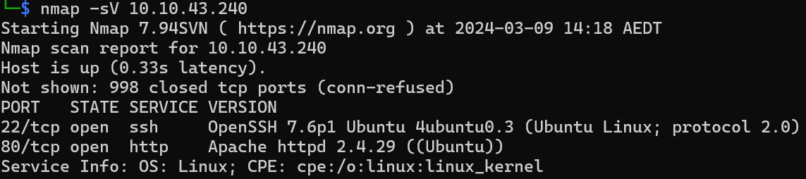
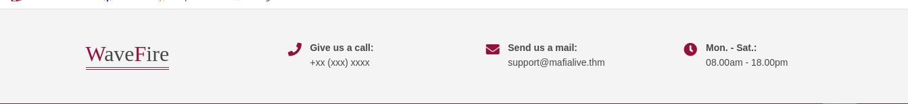

# TryHackMe - Archangel CTF Report (https://tryhackme.com/room/archangel)

## Objectives
Exploiting a well-known security solutions company

### Challenge 1
- Description: Get a shell
- Solution: 
    * I started by conducting a host scan using nmap to enumerate the open ports and services on the target machine. The scan revealed two open TCP ports; 22 (SSH) and 80 (HTTP)
        
    * As HTTP service was running on the machine, I accessed the webpage on my browser.The webpage belonged to WaveFire and contained an email address (support@mafialive.thm), which gave me answer to first task under challenge 1 (mafialive.thm).
        
    * I then inspected the source code of the webpage, but found nothing of interest. Hence, I used feroxbuster to scan for hidden directories. Although it resulted in an interesting directory listing named 'flags', it only contained a 'flag.html' file that redirected me to a youtube video (Rickrolled LOL!). My attempt to emumerate the hidden directories didn't result in anything useful. 
    * I then attempted to access the website using newly found hostname, mafialive.thm. I edited my hosts file to point mafialive.thm to the IP address of target machine. Now browsing the 'mafialive.thm' presented a webpage with required flag 1.
        
        
    

