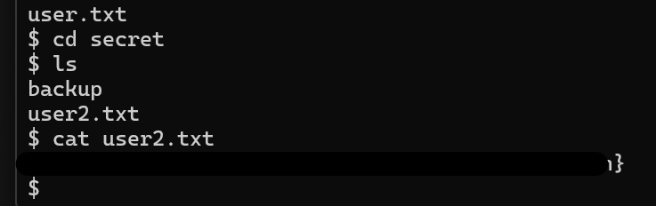

# TryHackMe - Archangel CTF Report (https://tryhackme.com/room/archangel)

## Objectives
Exploiting a well-known security solutions company

### Challenge 1
- Description: Get a shell
- Solution: 
    * I started by conducting a host scan using nmap to enumerate the open ports and services on the target machine. The scan revealed two open TCP ports; 22 (SSH) and 80 (HTTP)
        
    * As HTTP service was running on the machine, I accessed the webpage on my browser.The webpage belonged to WaveFire and contained an email address (support@mafialive.thm), which gave me answer to first task under challenge 1 (mafialive.thm).
        
    * I then inspected the source code of the webpage, but found nothing of interest. Hence, I used feroxbuster to scan for hidden directories. Although it resulted in an interesting directory listing named 'flags', it only contained a 'flag.html' file that redirected me to a youtube video (Rickrolled LOL!). My attempt to emumerate the hidden directories didn't result in anything useful. 
    * I then attempted to access the website using newly found hostname, mafialive.thm. I edited my hosts file to point mafialive.thm to the IP address of target machine. Now browsing the 'mafialive.thm' presented a webpage with required flag 1.
        
    * The next task was to find the page under development. For this, I utilized feroxbuster again, but time targeting the hostname 'http://mafialive.thm'. This returned the hidden under development file.
        
    * The hidden test.php was calling mrrobot.php file upon clicking the submit button, I used burpsuite repeater function to test multiple calls to function and was finally able to display content of test.php using php://filter/convert.base64-encoding in base64 encoding. I then saved it in a file and used base64 to decode it back to plaintext, where flag 2 was hidden.
        
    * After lots of hit and trial and research about lfi and log poisoining, I was finally able to execute a reverse shell on my local device. After getting reverse shell it was easy to access flag located at user's directory.
            

### Challenge 2
- Description: Root the machine
- Solution:
    * I was manually going to common directories to see if there are any interesting files and I found some in /opt directories. I then inserted a reverse shell command at EOF of helloworld.sh script to get a reverse shell on my local device. After waiting for some time I was able to get reverse shell.
        
    * As archangel user, I was able to access files within their home directories where I was able to retrieve User 2 flag.
        
    * I initially missed this and was trying to find someway to get root access but there was one executable file with SUID under folder 'secret' owned by user root. It was using 'cp' to copy files archangel's myfiles directory to /opt/backupfiles.
        
    * I then created 'cp' file that will call bash shell and changed the path to current path. Now when I executed ./backup i was able to get root terminal and access root flag.
           
