# TryHackMe - Startup CTF Report (https://tryhackme.com/room/startup)

## Objectives
The objective of this CTF was to perform a thorough penetration test on a startup company called "We are Spice Hut" and gain access to root files.

### Challenge 1
- Description: Recipe of secret soup
- Solution: 
    * With only IP addresses information at hand, I began by scanning the services running on the server. The nmap scan revealed 3 open ports:
        PORT   STATE SERVICE VERSION
        21/tcp open  ftp     vsftpd 3.0.3
        22/tcp open  ssh     OpenSSH 7.2p2 Ubuntu 4ubuntu2.10 (Ubuntu Linux; protocol 2.0)
        80/tcp open  http    Apache httpd 2.4.18 ((Ubuntu))
        Service Info: OSs: Unix, Linux; CPE: cpe:/o:linux:linux_kernel
        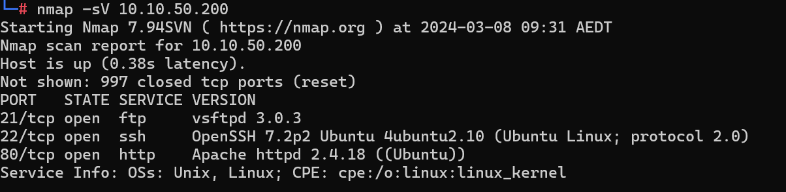
    * The next step was to assess the HTTP service further to see if there was anything of interest. It returned an information page indicating "No spice here!", and nothing on the index page seemed interesting.
        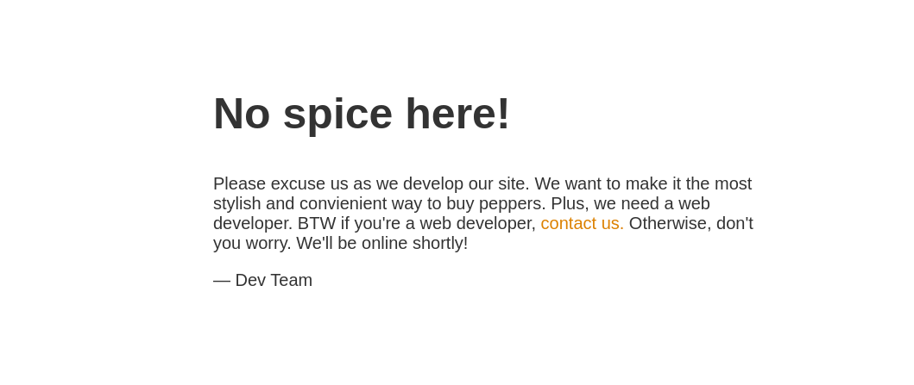
    * I then proceeded to check for any hidden directories on the server, using feroxbuster to brute force the server.
        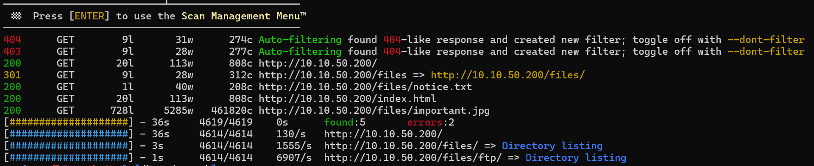
        Feroxbuster was able to uncover one hidden directory and two interesting hidden files within that directory. Upon inspection of notice.txt, it appeared that 'maya' could be a user on the system. However, other than that, nothing else seemed useful at this point. I attempted to connect to FTP using 'maya' as the user, but it asked for credentials. I then tried again with the user 'anonymous'. The anonymous login was successful, and I was able to access the same files that were accessible via the web, with the addition of .test.log, which wasn't useful in this case.
        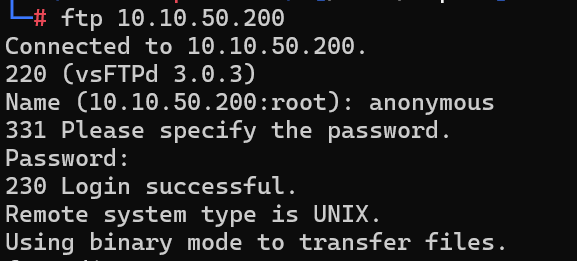 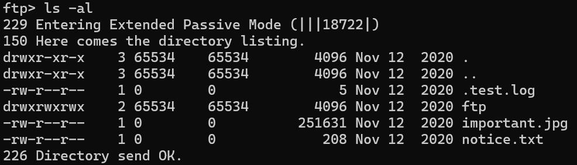
    * The logical next step was to try to upload a reverse shell to gain access to a shell. I used a PHP reverse shell from: https://github.com/pentestmonkey/php-reverse-shell/blob/master/php-reverse-shell.php. When I tried to upload the shell to the main directory, I received an error: "553 Could not create file.". I then tried to upload the shell inside the FTP directory, which was successful.
        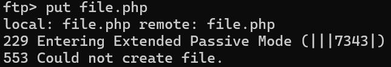 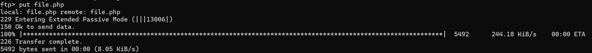
    * After uploading the shell and listening to port 8888 through netcat, I gained access to a shell with the user "www-data".
        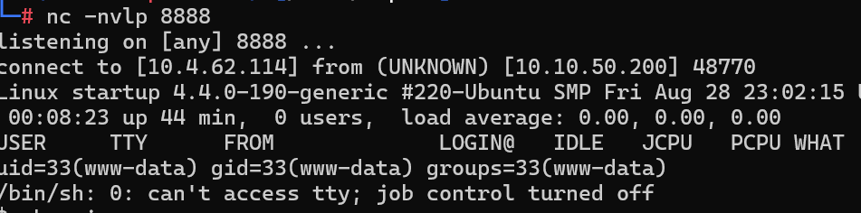
    This allowed me to successfully access the contents of the file recipe.txt, which revealed that the secret soup recipe was indeed "love".
        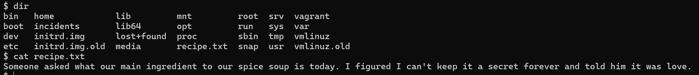

### Challenge 2
- Description: Access the contents of user.txt
- Solution:
    * After completing challenge 1, I had access to a reverse shell as www-data. I further enumerated the server to find any interesting objects. One particular folder, 'incidents', caught my attention. It contained a packet capture file "suspicious.pcapng".
            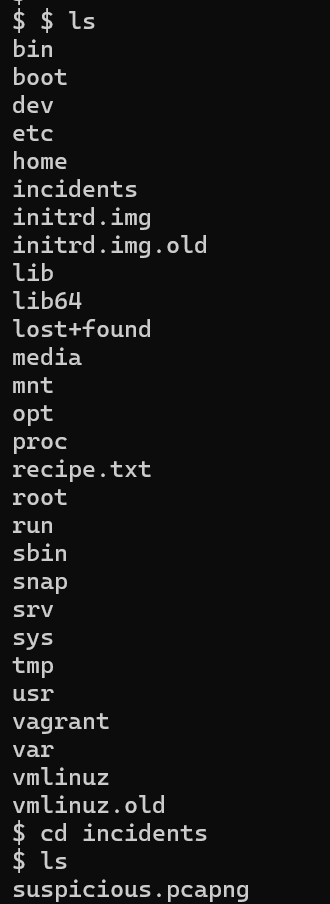
        - I used 'cat' to quickly go through the contents of the packet capture file, which seemed to contain a password for the user 'lennie'.
        - I spawned a bash shell using python3 and pty, and switched the current user to 'lennie', which allowed me to access the home directory of 'lennie' containing the user.txt file.
            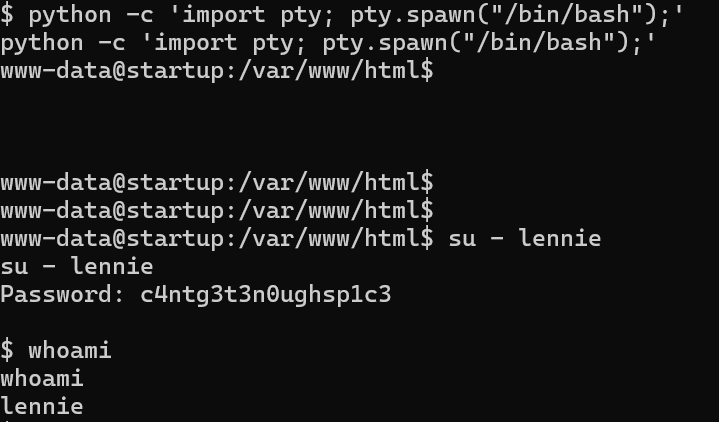 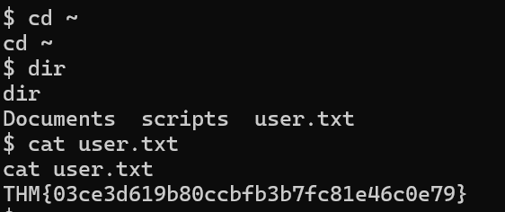

### Challenge 3
- Description: Access the contents of root.txt
- Solution:
    * While going through the contents of lennie's home directory, I found an interesting file named planner.sh. It was owned by root but it had the location of another script, print.sh, located in the /etc/ directory which was owned by lennie. I modified the print.sh file and added commands to create a reverse shell.
        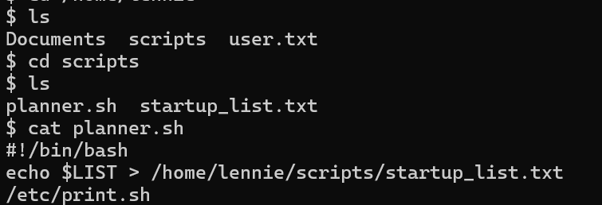 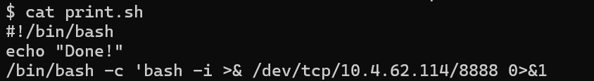
    * After starting netcat to listen on port 8888 on my local machine and waiting for some time, I successfully gained access to the root terminal which allowed me to access the contents of root.txt.
        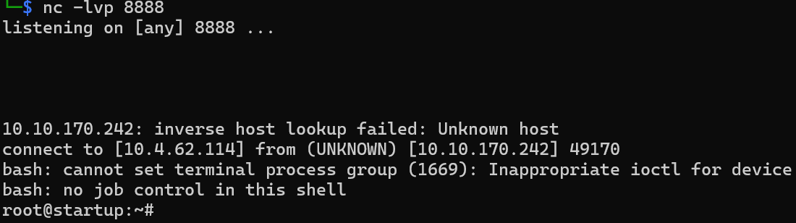 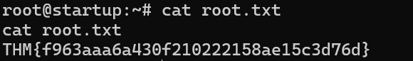